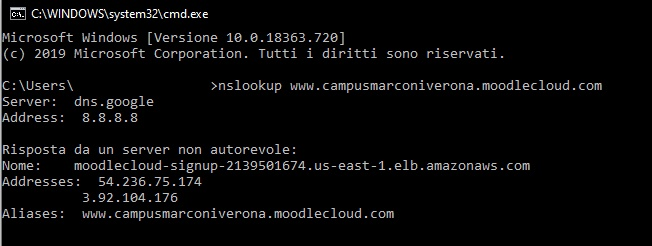

Bonetti Pietro – Team 4 - Test Case Specification

# Test Case Specification for Team 4

April 14, 2020

Prepared by:

Pietro Bonetti

# **Table of Contents**

## 1. INTRODUCTION………………….…………………………………………..4

## 2. TEST CASES: GOOGLE CHROME….………………………………….…4

## 3. TEST CASES: MOZILLA FIREFOX…………………………………….….5

## 4. TEST CASES: MICROSOFT EDGE...………………………………..……6

## 5. TEST DNS...................................….........………………………………….8
---

Revision History

| **Version** | **Date** | **Name** | **Description** |
| --- | --- | --- | --- |
| 1 | 14/04/2020 | Pietro Bonetti | Initial Document |
| 2 | 24/04/2020 | Pietro Bonetti | Updated document to eliminate typographical errors |

# 1. Introduction

## This document provides the test cases to be carried out for the English Course FCE on MOODLE. Each item to be tested is represented by an individual test case. Each case details the input and expected outputs.
---

# 2. Test Cases: Google Chrome Application

| Test ID | 2.1 |
| --- | --- |
| Title | Correct Login |
| Feature | Login to www.campusmarconiverona.moodlecloud.com |
| Objective | Confirm that user id and password permit to access to the website as expected. |
| Setup | Operating system Windows 10 18363 with Google Chrome v. 81.0.4044.122 |
| Test Data | Login informationUsername= bonetti\_pietroPassword = \*\*\*\*\*\*\*\*\*\* |
| Test Actions | 1. Going to website2. Select account3. Enter login information |
| Expected Results | The platform displays the available courses for the logged user |

| Test ID | 2.2 |
| --- | --- |
| Title | Incorrect Password |
| Feature | Login to www.campusmarconiverona.moodlecloud.com |
| Objective | Confirm that valid user id with an invalid password denies access to the website |
| Setup | Operating system Windows 10 18363 with Google Chrome v. 81.0.4044.122 |
| Test Data | Correct user e-mail, incorrect passwordUsername= bonetti\_pietroPassword = password |
| Test Actions | 1. Going to website2. Select account3. Enter login information |
| Expected Results | System displays error message with option to try again. |

| Test ID | 2.3 |
| --- | --- |
| Title | Incorrect Username |
| Feature | Login to www.campusmarconiverona.moodlecloud.com |
| Objective | Confirm that invalid user id denies access to the website |
| Setup | Operating system Windows 10 18363 with Google Chrome v. 81.0.4044.122 |
| Test Data | Incorrect user e-mail, incorrect passwordUsername = pietro\_bonettiPassword = \*\*\*\*\*\*\*\*\*\* |
| Test Actions | 1. Going to website2. Select account3. Enter login information |
| Expected Results | System displays error message with option to try again. |
---

# 3. Test Cases: Mozilla Firefox

| Test ID | 3.1 |
| --- | --- |
| Title | Correct Login |
| Feature | Login to www.campusmarconiverona.moodlecloud.com |
| Objective | Confirm that user id and password permit to access to the website as expected. |
| Setup | Operating system Windows 10 18363 with Mozilla Firefox v. 64.0.2 |
| Test Data | Login informationUsername= bonetti\_pietroPassword = \*\*\*\*\*\*\*\*\*\* |
| Test Actions | 1. Going to website2. Select account3. Enter login information |
| Expected Results | The platform displays the available courses for the logged user |

| Test ID | 3.2 |
| --- | --- |
| Title | Incorrect Password |
| Feature | Login to www.campusmarconiverona.moodlecloud.com |
| Objective | Confirm that valid user id with an invalid password denies access to the website |
| Setup | Operating system Windows 10 18363 with Mozilla Firefox v. 64.0.2 |
| Test Data | Correct user e-mail, incorrect passwordUsername= bonetti\_pietroPassword = password |
| Test Actions | 1. Going to website2. Select account3. Enter login information |
| Expected Results | System displays error message with option to try again. |

| Test ID | 3.3 |
| --- | --- |
| Title | Incorrect Username |
| Feature | Login to www.campusmarconiverona.moodlecloud.com |
| Objective | Confirm that invalid user id denies access to the website |
| Setup | Operating system Windows 10 18363 with Mozilla Firefox v. 64.0.2 |
| Test Data | Incorrect user e-mail, incorrect passwordUsername = pietro\_bonettiPassword = \*\*\*\*\*\*\*\*\*\* |
| Test Actions | 1. Going to website2. Select account3. Enter login information |
| Expected Results | System displays error message with option to try again. |
---

# 4. Test Cases: Microsoft Edge Application

| Test ID | 4.1 |
| --- | --- |
| Title | Correct Login |
| Feature | Login to www.campusmarconiverona.moodlecloud.com |
| Objective | Confirm that user id and password permit to access to the website as expected. |
| Setup | Operating system Windows 10 18363 with Microsoft Edge v. 44.18362.449.0 |
| Test Data | Login informationUsername= bonetti\_pietroPassword = \*\*\*\*\*\*\*\*\*\* |
| Test Actions | 1. Going to website2. Select account3. Enter login information |
| Expected Results | The platform displays the available courses for the logged user |

| Test ID | 4.2 |
| --- | --- |
| Title | Incorrect Password |
| Feature | Login to www.campusmarconiverona.moodlecloud.com |
| Objective | Confirm that valid user id with an invalid password denies access to the website |
| Setup | Operating system Windows 10 18363 with Microsoft Edgev. 44.18362.449.0 |
| Test Data | Correct user e-mail, incorrect passwordUsername= bonetti\_pietroPassword = password |
| Test Actions | 1. Going to website2. Select account3. Enter login information |
| Expected Results | System displays error message with option to try again. |

| Test ID | 4.3 |
| --- | --- |
| Title | Incorrect Username |
| Feature | Login to www.campusmarconiverona.moodlecloud.com |
| Objective | Confirm that invalid user id denies access to the website |
| Setup | Operating system Windows 10 18363 with Microsoft Edge v. 44.18362.449.0 |
| Test Data | Incorrect user e-mail, incorrect passwordUsername = pietro\_bonettiPassword = \*\*\*\*\*\*\*\*\*\* |
| Test Actions | 1. Going to website2. Select account3. Enter login information |
| Expected Results | System displays error message with option to try again. |
---

# 5. Test DNS

